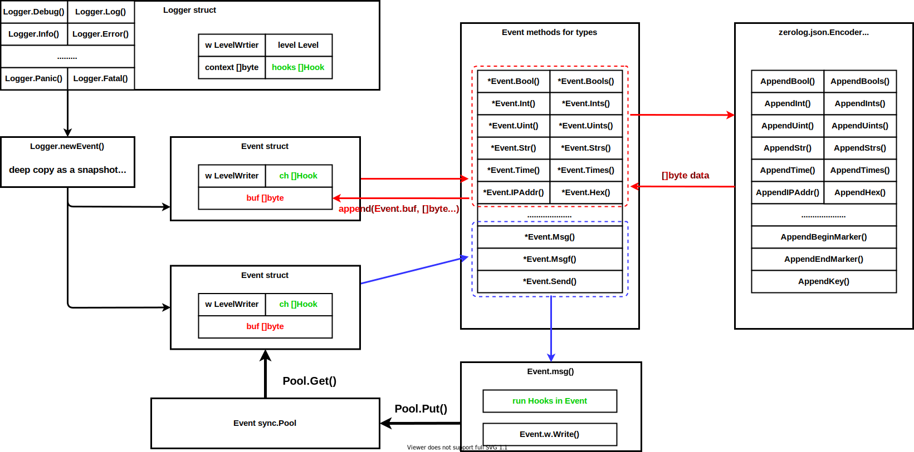

# 一个怎样的 log 才算比较好

- 日志的本质正是**留档待查**


**log 会被怎么用？**

很显然，评判一个 log package 是不是好的标准是：能不能很好的满足我们的需求，那么我们通常会怎么使用 log 呢？我们希望能够根据 log 做些什么事情？

- log 尽可能不会丢失
- 在 debug、develop 的时候，log 尽可能快的打印出来；
  - log 能够提供足够多的信息来进行 debug
  - 最好能记录函数名、行号
- log 要有分级；紧急的，能够做到自动告警 --> *具备 Hook 能力*
  - 要有动态开关
- log 不仅仅输出到本地磁盘，最好也能输出到远程仓库
- log 能够被自动化工具进行分析、汇总 --> *结构化日志*
  - 结构化日志包有利于程序进行分析，但是不利于人类进行阅读
- 要记录时间
- 线上日志要能够让使用者尽可能快的定位问题，解决问题
- 不同部署环境能够采用不同的格式进行输出
  - 比如，现网环境为了方便日志采集，通常会输出 JSON 格式的日志；开发测试环境为了方便查看日志，会输出 TEXT 格式的日志。
- 要进行日志分割，压缩归档，轮转 --> *Logrotate*, *lumberjack*, *file-rotatelogs*
- 尽可能不拖累 app 的处理性能；因为日志函数的调用必然是极度频繁的
- 并发安全
- 格式可配置
- log 去重，避免大量刷重复日志的问题
- 怎么融合第三方库中的日志


**API 兼容**

- 要是你的 public API，基本上是跟标准库，知名公开库一样的话，别人要使用你的 log 库会变得很方便，只需要在 import 那里改一改就完事了


# 程序员打印日志的注意事项

不能随意打日志，不然出了问题，出来一堆有的没的，只会影响你 debug

- 在分支处，打印日志，帮助你判断进入了哪一个分支
- 避免再循坏里面打印日志，而是输出循环的总体情况
- 重要操作要打日志
- 不要输出一些敏感信息，例如密码、密钥等
- 日志内容应该小写字母开头
- 为了提高性能，尽可能使用明确的类型，而非 `%v`
- 日志最好包含两个信息。一个是请求 ID（RequestID），是每次请求的唯一 ID，便于从海量日志中过滤出某次请求的日志，可以将请求 ID 放在请求的通用日志字段中。另一个是用户和行为，用于标识谁做了什么
  - 不然在进行并发日志输出的时候，基本上分不清这一行日志是在为哪一个请求进行处理，那么日志本身的跟踪 debug 就无从谈起了


# Linux 文件并发操作会发生什么？

> - The Linux Programming Interface, chat 5.1
>   - ==All system calls are executed atomically==. By this, we mean that the kernel guarantees that all of the steps in a system call are completed as a single operation, without being interrupted by another process or thread.
>   - 但是前后两次 system call 在没有另外带 mutex 的情况下，就不可能是 atomic 的了

- Using a single `open()` call that specifies the `O_CREAT` and `O_EXCL` flags prevents this possibility by guaranteeing that the check and creation steps are carried out as a single atomic (i.e., uninterruptible) operation.
  - 想要唯一创建一个文件的话，就不要用一个 `open()` 来检查文件是否存在，另一个 `open()` 来创建文件
  - 而是在同一个 `open()` 中，同时指定  `O_CREAT` and `O_EXCL`
- Avoiding this problem requires that the seek to the next byte past the end of the file and the write operation happen atomically. This is what opening a file with the `O_APPEND` flag guarantees.


> https://github.com/sirupsen/logrus#thread-safety
>
> https://www.notthewizard.com/2014/06/17/are-files-appends-really-atomic/
>
> http://stackoverflow.com/questions/1154446/is-file-append-atomic-in-unix

- 多线程的 IO 写操作，在操作系统层面就已经实现了 atomic 的效果。所以实际上程序中的 log 是不需要任何 mutex 进行保护的。
- 之所以需要进行保护是因为我们有了其他的配置在这个 logger 里面


**Situation when locking is not needed includes:**

- You have no hooks registered, or hooks calling is already thread-safe.（lock 是用来保护配置的）

- Writing to `logger.Out` is already thread-safe, for example:

  1. `logger.Out` is protected by locks.（因为 `io.Writer` 并没有要是并发安全，所以需要使用者自己确定）

  2. `logger.Out` is an os.File handler opened with `O_APPEND` flag(操作系统提供了并发安全的保证), and every write is smaller than 4k. (This allows multi-thread/multi-process writing)

     (Refer to http://www.notthewizard.com/2014/06/17/are-files-appends-really-atomic/)


# 打印函数名带来的性能问题

- 对于 C 语言来说，函数名、行号，实际上是通过宏替换来实现的
  - 相当于 GCC 在预处理阶段自动帮你把行号、函数名卸载每一行 log 里面
  - 又因为 C 可以通过宏替换的方式，简洁的完成大量代码的强制 inline 操作，所以 C 可以先通过宏获取函数名字、行号，然后将函数名、行号传递给相应的 lig 函数，从而极大程度降低了对 runtime 的性能损耗
- 但是，Go 并没有这样的宏预处理过程，所以也就不得不从 runtime 中获取函数名、行号，进而带来了一定的性能开销


# 开源调研

## log

> base on: go1.17.7 linux/amd64
>
> https://pkg.go.dev/log

- 支持指定文件输出位置，而且是采用 `io.writer` 作为接口的，所以是能够将日志通过网络的方式传输出去的（`func SetOutput(w io.Writer)`）


### quick demo

**demo 1**

```go
package main

import (
	"log"
	"os"
)

func main() {
	// log to file
	logFile, err := os.Create("./log.log")
	defer logFile.Close()
	if err != nil {
		log.Fatalln("create file log.log failed")
	}
	logger := log.New(logFile, "[Debug] ", log.Lshortfile)
	logger.Print("call Print: line1")
	logger.Println("call Println: line2")

	// change configuration for log package
	logger.SetPrefix("[Info] ")
	logger.SetFlags(log.Ldate)
	logger.SetOutput(os.Stdout)
	logger.Print("Info check stdout")
}
```

```bash
[root@LC demo]# go run main.go 
[Info] 2022/09/24 Info check stdout
[root@LC demo]# cat log.log 
[Debug] main.go:17: call Print: line1
[Debug] main.go:18: call Println: line2
[root@LC demo]# 
```


### `Logger` struct

```go
// A Logger represents an active logging object that generates lines of
// output to an io.Writer. Each logging operation makes a single call to
// the Writer's Write method. A Logger can be used simultaneously from
// multiple goroutines; it guarantees to serialize access to the Writer.
// Logger 本身并不需要是一个 io.Writer, 因为 Logger 具体往哪里 log 是看配置的，所以 Logger has-a io.Writer 也是可以的
type Logger struct {
    // ensures atomic writes; protects the following fields, 并发安全
	mu     sync.Mutex
    // prefix on each line to identify the logger (but see Lmsgprefix)，perfix 是配置后固定的，不需要每次都生成
	prefix string     
	flag   int        // properties
    // destination for output, 通过 io.Writer 进行解耦，让 Logger 既能够向 socket 输出，也能够向文件输出
	out    io.Writer  
	buf    []byte     // for accumulating text to write，格式化时使用
}
```


### 输出日志的过程

**step 1:**

- 首先是我们调用不同的 print log 函数
- 然后利用 `fmt.Sprint` 来完成字符串的格式化（完成用户输出内容的处理）

- 基本支持三种输出格式：`Print`, `Printf`, `Println`

```go
// step 1: 然后利用 fmt.Sprint 来完成字符串的格式化（完成用户输出内容的处理）
// step 2: 在 Logger 这一层完成 log 的格式化
// Printf calls l.Output to print to the logger.
// Arguments are handled in the manner of fmt.Printf.
func (l *Logger) Printf(format string, v ...interface{}) {
	l.Output(2, fmt.Sprintf(format, v...))
}

// Print calls l.Output to print to the logger.
// Arguments are handled in the manner of fmt.Print.
func (l *Logger) Print(v ...interface{}) { l.Output(2, fmt.Sprint(v...)) }

// Println calls l.Output to print to the logger.
// Arguments are handled in the manner of fmt.Println.
func (l *Logger) Println(v ...interface{}) { l.Output(2, fmt.Sprintln(v...)) }
```


**step 2:**

- 在 Logger 这一层完成 log 的格式化，使得 `Output()` 拿到的即使完成了 fmt 的 string

- 但是最后依然是调用底层的 `func (l *Logger) Output(calldepth int, s string)`

```go
// 完成前缀、时间、追加换行、实际输出等工作；不需要理会 fmt 的事情
func (l *Logger) Output(calldepth int, s string) error {
	now := time.Now() // get this early.
	var file string
	var line int

	// 实际 write 是加锁的，所以不会有并发问题
	l.mu.Lock()
	defer l.mu.Unlock()
	if l.flag&(Lshortfile|Llongfile) != 0 {
		// 临时释放锁，因为获取文件信息实在是太耗时了
		// 这里基本都是操作函数内的临时变量，所以不锁也是可以的
		// Release lock while getting caller info - it's expensive.
		l.mu.Unlock()
		var ok bool
		_, file, line, ok = runtime.Caller(calldepth)
		if !ok {
			file = "???"
			line = 0
		}
		l.mu.Lock()
	}
	l.buf = l.buf[:0] // reset

	/* Header */
	l.formatHeader(&l.buf, now, file, line) // 直接让底层操作当前的 slice

	/* 实际内容 */
	l.buf = append(l.buf, s...) // 避免生成新的 slice 对象

	/* 追加换行 */
	if len(s) == 0 || s[len(s)-1] != '\n' {
		l.buf = append(l.buf, '\n')
	}
	_, err := l.out.Write(l.buf) // 实际输出
	return err
}


// 格式化 log 前缀，这个函数的调用是被锁保护起来的，因为每个 Logger 的 buf 就一个
func (l *Logger) formatHeader(buf *[]byte, t time.Time, file string, line int) {
	/* 加入前缀 */
	if l.flag&Lmsgprefix == 0 {
		*buf = append(*buf, l.prefix...)
	}

	/* 加入时间 */
	if l.flag&(Ldate|Ltime|Lmicroseconds) != 0 {
		.....
        year, month, day := t.Date()
        itoa(buf, year, 4)
        *buf = append(*buf, '/')
        ......
	}

	/* 文件名、行号 */
	if l.flag&(Lshortfile|Llongfile) != 0 {
		........
		itoa(buf, line, -1)
		*buf = append(*buf, ": "...)
	}
	if l.flag&Lmsgprefix != 0 {
		*buf = append(*buf, l.prefix...)
	}
}

```


## cuslog demo

> https://github.com/marmotedu/gopractise-demo/tree/main/log/cuslog


## logrus

- 因为 `WithField()` 中使用了 reflect package，所以性能没办法很高

- 从代码上看，推荐的使用方法是：
  - request scope 范围内，创建通过 `WithFields()` 创建一个记录了关键信息的 `Entry`，然后在这个 request scpoe 范围内都采用这个 `Entry` 进行日志输出
  - 而且因为 `WithFields()` 创建出来的 `Entry` 对象并不是全部都在 pool 里面缓存起来的，所以不要满天飞的 `WithFields()` 函数


### quick demo

**demo 1**

```go
package main

import (
	"main/logrus"
	"os"
)

func init() {
	// Log as JSON instead of the default ASCII formatter.
	logrus.SetFormatter(&logrus.JSONFormatter{})

	// Output to stdout instead of the default stderr
	// Can be any io.Writer, see below for File example
	logrus.SetOutput(os.Stdout)

	// Only logrus the warning severity or above.
	logrus.SetLevel(logrus.WarnLevel)

    // record funtcion name and file name, line number
    // 性能会有一定的损耗
	logrus.SetReportCaller(true)
}

func main() {
	logrus.WithFields(logrus.Fields{
		"animal": "walrus",
		"size":   10,
	}).Info("A group of walrus emerges from the ocean")

	logrus.WithFields(logrus.Fields{
		"omg":    true,
		"number": 122,
	}).Warn("The group's number increased tremendously!")

	logrus.WithFields(logrus.Fields{
		"omg":    true,
		"number": 100,
	}).Fatal("The ice breaks!")

	// A common pattern is to re-use fields between logging statements by re-using
	// the logrus.Entry returned from WithFields()
	contextLogger := logrus.WithFields(logrus.Fields{
		"common": "this is a common field",
		"other":  "I also should be logged always",
	})

	contextLogger.Info("I'll be logged with common and other field")
	contextLogger.Info("Me too")
}

```

```bash
[root@LC logrus]# go run demo-1.go 
{"file":"/root/learn/WF/Go-Three-Party-Packages_note/log-related/logrus/demo-1.go:33","func":"main.main","level":"warning","msg":"The group's number increased tremendously!","number":122,"omg":true,"time":"2022-09-26T20:32:59+08:00"}
{"file":"/root/learn/WF/Go-Three-Party-Packages_note/log-related/logrus/demo-1.go:38","func":"main.main","level":"fatal","msg":"The ice breaks!","number":100,"omg":true,"time":"2022-09-26T20:32:59+08:00"}
exit status 1
```


**demo 2:**

```go
package main

import (
	"os"
	"main/logrus"
)

// Create a new instance of the logger. You can have any number of instances.
var log = logrus.New()

func main() {
	// The API for setting attributes is a little different than the package level
	// exported logger. See Godoc.
	log.Out = os.Stdout

	// You could set this to any `io.Writer` such as a file
	// file, err := os.OpenFile("logrus.log", os.O_CREATE|os.O_WRONLY|os.O_APPEND, 0666)
	// if err == nil {
	//  log.Out = file
	// } else {
	//  log.Info("Failed to log to file, using default stderr")
	// }

	log.WithFields(logrus.Fields{
		"animal": "walrus",
		"size":   10,
	}).Info("A group of walrus emerges from the ocean")
}
```


### Logger struct

- `logrus.Logger` 同样也是采用 has-a 的方式来保存 `io.Writer`，最后完成输出

```go
type Logger struct {
	Out io.Writer
	Hooks LevelHooks
	Formatter Formatter

	// 是否打印函数名、行号，因为比较耗性能，所以默认是关闭的
	ReportCaller bool
	Level Level
	// Used to sync writing to the log. Locking is enabled by Default
	// 把 mutex disabled 的检测也封装进这个 struct 里面，省的到处检查
	mu MutexWrap
	entryPool sync.Pool
    
	// 遇上 logrus.Fatal() 的时候，做优雅退出。回调函数
	ExitFunc exitFunc

	BufferPool BufferPool
}
```

- `Logger` struct 这一层更多的是：适配不同库的 API，达到平滑替换的效果

```go
[root@LC logrus]# go doc logrus Logger
.....
func (logger *Logger) Debug(args s...interface{})
func (logger *Logger) DebugFn(fn LogFunction)
func (logger *Logger) Debugf(format string, args ...interface{})
func (logger *Logger) Debugln(args ...interface{})

func (logger *Logger) Error(args ...interface{})
func (logger *Logger) ErrorFn(fn LogFunction)
func (logger *Logger) Errorf(format string, args ...interface{})
func (logger *Logger) Errorln(args ...interface{})

func (logger *Logger) Fatal(args ...interface{})
func (logger *Logger) FatalFn(fn LogFunction)
func (logger *Logger) Fatalf(format string, args ...interface{})
func (logger *Logger) Fatalln(args ...interface{})

func (logger *Logger) Info(args ...interface{})
func (logger *Logger) InfoFn(fn LogFunction)
func (logger *Logger) Infof(format string, args ...interface{})
func (logger *Logger) Infoln(args ...interface{})

func (logger *Logger) Log(level Level, args ...interface{})
func (logger *Logger) LogFn(level Level, fn LogFunction)
func (logger *Logger) Logf(level Level, format string, args ...interface{})
func (logger *Logger) Logln(level Level, args ...interface{})

func (logger *Logger) Panic(args ...interface{})
func (logger *Logger) PanicFn(fn LogFunction)
func (logger *Logger) Panicf(format string, args ...interface{})
func (logger *Logger) Panicln(args ...interface{})

func (logger *Logger) Print(args ...interface{})
func (logger *Logger) PrintFn(fn LogFunction)
func (logger *Logger) Printf(format string, args ...interface{})
func (logger *Logger) Println(args ...interface{})

.....
func (logger *Logger) Trace(args ...interface{})
func (logger *Logger) TraceFn(fn LogFunction)
func (logger *Logger) Tracef(format string, args ...interface{})
func (logger *Logger) Traceln(args ...interface{})

func (logger *Logger) Warn(args ...interface{})
func (logger *Logger) WarnFn(fn LogFunction)
func (logger *Logger) Warnf(format string, args ...interface{})

func (logger *Logger) Warning(args ...interface{})
func (logger *Logger) WarningFn(fn LogFunction)
func (logger *Logger) Warningf(format string, args ...interface{})
func (logger *Logger) Warningln(args ...interface{})
func (logger *Logger) Warnln(args ...interface{})
......
```


- 无论是哪种形式的 log 函数，最终 `logrus.Logger` 总是交给 `logrus.Entry` 进行处理

```go
// 形式一：
// Adds a struct of fields to the log entry. All it does is call `WithField` for
// each `Field`.
// NOTE: 注意看，WithFields() 是一个 method（哪怕 global 的 WithFields()） 函数最后也是通过
// std.WithFields() 的
// 为什么要这样？因为每一个 Entry 是不具有 io.Writer 的，而 io.Writer 是 logrus.Logger 的
// 其实也是暗示了: Entry 离开了 Logger 其实是没有意义的
func (logger *Logger) WithFields(fields Fields) *Entry {
	entry := logger.newEntry()
	defer logger.releaseEntry(entry)
	return entry.WithFields(fields)
}

// 形式二：
func (logger *Logger) Trace(args ...interface{}) {
	logger.Log(TraceLevel, args...)
}

// Log will log a message at the level given as parameter.
// Warning: using Log at Panic or Fatal level will not respectively Panic nor Exit.
// For this behaviour Logger.Panic or Logger.Fatal should be used instead.
func (logger *Logger) Log(level Level, args ...interface{}) {
	if logger.IsLevelEnabled(level) {
		entry := logger.newEntry()
		entry.Log(level, args...)
		logger.releaseEntry(entry)
	}
}
```


### Entry struct

- An `Entry` is the final or intermediate Logrus logging entry.
- `Entry` 的 `WithXXXX()`，或者是 `Logger` 的 `WithXXX()` 之所以返回的全部都是 `Entry` 其实是向表达：这些字段就跟着这个 `Entry` Object 走了，毕竟日志在跟踪某一个 session 的时候，每一行都会把这个 session 的唯一标识都打印出来，所以 logrus 直接记录起来，不需要总是手动代码写死
  - 其实这样也是为了减少 reflect 的频率
- `Entry` 的修改并不是并发安全的，但是 logrus 里面重来都不会直接修改的，都是通过 COW 的方式来应对并发问题

```bash
func (logger *Logger) newEntry() *Entry {
	// NOTE: 实话说，这个 Entry 也就 logrus.Infof() 这样的时候有点用
	// 因为 Entry.WithFields() 实际上返回的又是一个新的 Entry，而且是不从 pool 拿的 Entry
	entry, ok := logger.entryPool.Get().(*Entry)
	if ok {
		// 因为 logrus 中所有 Logger 都是没有设置 entryPool 的
		// 这时候，entryPool.Get() 返回的是 nil，所以断言就会失败
		// 然后再由这个函数进行一次 NewEntry()
		// 实际上，这一点是不必要的，可以设置 entryPool.New 这个 field（闭包传进去就好了）
		return entry
	}

	// Entry struct 自己仅仅是一个普通的 Entry struct
	// 并不需要理会是否应该使用 pool 作为缓存，
	// 是否利用缓存这件事，是上层决定的，所有交由 Logger struct 来做 pool 缓存
	return NewEntry(logger)
}

func NewEntry(logger *Logger) *Entry {
	return &Entry{
		Logger: logger,
		// Default is three fields, plus one optional.  Give a little extra room.
		Data: make(Fields, 6),
	}
}
```


```go
// An entry is the final or intermediate Logrus logging entry. It contains all
// the fields passed with WithField{,s}. It's finally logged when Trace, Debug,
// Info, Warn, Error, Fatal or Panic is called on it. These objects can be
// reused and passed around as much as you wish to avoid field duplication.
// Entry 是实际进行日志记录的实体，而且这个 Entry 实体是跟具体的 Fields 绑定的
// 为了提高性能，这个 Entry 是可以重复利用，甚至是 pass around 的
type Entry struct {
	// 因为 Entry 并没有 io.Writer, 所以还是要记录自己属于哪一个 logrus.Logger 的
	Logger *Logger

    // 传参部分
	// Contains all the fields set by the user.
	// 跟着这个 Entry 走的数据（相当于 session 的唯一标识，每次都把它们打印出来）
	Data Fields
	Time time.Time
	Level Level
	Caller *runtime.Frame
	Message string
	Buffer *bytes.Buffer
	Context context.Context
	err string
}

```

- 而且，`Entry` 也是适配了常规的 log method 的，可以做到平滑替换

```go
func (entry *Entry) Debug(args ...interface{})
func (entry *Entry) Debugf(format string, args ...interface{})
func (entry *Entry) Debugln(args ...interface{})

func (entry *Entry) Error(args ...interface{})
func (entry *Entry) Errorf(format string, args ...interface{})
func (entry *Entry) Errorln(args ...interface{})

func (entry *Entry) Fatal(args ...interface{})
func (entry *Entry) Fatalf(format string, args ...interface{})
func (entry *Entry) Fatalln(args ...interface{})

func (entry *Entry) Info(args ...interface{})
func (entry *Entry) Infof(format string, args ...interface{})
func (entry *Entry) Infoln(args ...interface{})

func (entry *Entry) Log(level Level, args ...interface{})
func (entry *Entry) Logf(level Level, format string, args ...interface{})
func (entry *Entry) Logln(level Level, args ...interface{})

func (entry *Entry) Panic(args ...interface{})
func (entry *Entry) Panicf(format string, args ...interface{})
func (entry *Entry) Panicln(args ...interface{})

func (entry *Entry) Print(args ...interface{})
func (entry *Entry) Printf(format string, args ...interface{})
func (entry *Entry) Println(args ...interface{})

func (entry *Entry) Trace(args ...interface{})
func (entry *Entry) Tracef(format string, args ...interface{})
func (entry *Entry) Traceln(args ...interface{})

func (entry *Entry) Warn(args ...interface{})
func (entry *Entry) Warnf(format string, args ...interface{})
func (entry *Entry) Warning(args ...interface{})
func (entry *Entry) Warningf(format string, args ...interface{})
func (entry *Entry) Warningln(args ...interface{})
func (entry *Entry) Warnln(args ...interface{})
```


- 通常创建 `Entry` 是会有两个途径的

```go
/* WithFields() 创建 Entry */
// A common pattern is to re-use fields between logging statements by re-using
// the logrus.Entry returned from WithFields()
contextLogger := logrus.WithFields(logrus.Fields{
    "common": "this is a common field",
    "other":  "I also should be logged always",
})

// WithFields creates an entry from the standard logger and adds multiple
// fields to it. This is simply a helper for `WithField`, invoking it
// once for each field.
//
// Note that it doesn't log until you call Debug, Print, Info, Warn, Fatal
// or Panic on the Entry it returns.
func WithFields(fields Fields) *Entry {
	return std.WithFields(fields)
}

// Adds a struct of fields to the log entry. All it does is call `WithField` for
// each `Field`.
// NOTE: 注意看，WithFields() 是一个 method（哪怕 global 的 WithFields()） 函数最后也是通过
// std.WithFields() 的
// 为什么要这样？因为每一个 Entry 是不具有 io.Writer 的，而 io.Writer 是 logrus.Logger 的
// 其实也是暗示了: Entry 离开了 Logger 其实是没有意义的
func (logger *Logger) WithFields(fields Fields) *Entry {
	entry := logger.newEntry()
	defer logger.releaseEntry(entry)
	return entry.WithFields(fields)
}

func (logger *Logger) newEntry() *Entry {
	// NOTE: 实话说，这个 Entry 也就 logrus.Infof() 这样的时候有点用
	// 因为 Entry.WithFields() 实际上返回的又是一个新的 Entry，而且是不从 pool 拿的 Entry
	entry, ok := logger.entryPool.Get().(*Entry)
	if ok {
		// 因为 logrus 中所有 Logger 都是没有设置 entryPool 的
		// 这时候，entryPool.Get() 返回的是 nil，所以断言就会失败
		// 然后再由这个函数进行一次 NewEntry()
		// 实际上，这一点是不必要的，可以设置 entryPool.New 这个 field（闭包传进去就好了）
		return entry
	}

	// Entry struct 自己仅仅是一个普通的 Entry struct
	// 并不需要理会是否应该使用 pool 作为缓存，
	// 是否利用缓存这件事，是上层决定的，所有交由 Logger struct 来做 pool 缓存
	return NewEntry(logger)
}


// Add a map of fields to the Entry.
// 填充每一个 Entry 的 Data 这个 map（做到 struct 化的第一步）
// 返回 *Entry 是为了能够进行链式调用，方便后续追加 Message 之类的
func (entry *Entry) WithFields(fields Fields) *Entry {
	// Q&A(DONE): 为什么要创建一个临时 logrus.Fields map ? 而且还做了一个 deep copy
	// 因为这个函数返回的是一个新的 Entry，这个新的 Entry 是基于原始 receiver 的 Entry 的基础上
	// 再补充新的 param 而构成的
	// 所以整个函数的基调是：在原有的基础上，追加 fields param 带来的新变化
	// Q&A(DONE): 为什么要采用这种如此慢的方式每次都构建新的 Entry ？
	// 这其实就涉及到了，Entry 这玩意的定位问题:
	// 1. Entry 的存在，很大程度上是为了减少 reflact 的使用（因为 reflact 存在相当大的性能问题），
	//    而使用的一个中间层概念
	// 2. 鉴于 Go 擅长的是后端，基本上是基于 request-response 的模型构建的后端服务，
	//    那么每一次 request 只进行一次 reflact 解析，这个 request scope 内重复利用这个 Entry，
	//    就可以最大程度的规避 reflact 的性能问题了（类似于每一个 HttpHandler 就只解析一次 Context）
	// 3. 记录每个 session、request scope 必须要有的标识、跟踪信息（session-id、trace-id、ip-port、mac-address 之类的）
	//    这是在查看日志时，按 session 查看的必要信息。
	// Q&A(DONE): 为什么每次 data 都是重新分配且 deep copy？
	// 1. 因为 Entry 可能会被重复利用，但是又没有相应的 reset 操作，所以要重新创建 Fields map
	// 2. 避免 rehash，毕竟改动 Entry.data 的可能性还是很低的（显然一次性更新更好）
	// 3. 真正的原因是这个函数的旧注释：https://github.com/sirupsen/logrus/pull/1229
	//    This function is not declared with a pointer value because otherwise
	//    race conditions will occur when using multiple goroutines
	//    这个函数本来的 receiver 是变量，而不是指针，因为 logrus 采用 COW 的方案来避免并发问题！
	//    所以你才会看到总是分配新的 logrus.Fields, logrus.Entry
	data := make(Fields, len(entry.Data)+len(fields)) // cap = 旧的 + 新的
	for k, v := range entry.Data {
		// NOTE: copy on write to avoid race conditions
		// deep copy
		data[k] = v
	}

	/* check type and generate key and value as field */
	fieldErr := entry.err
	for k, v := range fields {
		isErrField := false
		if t := reflect.TypeOf(v); t != nil {
			// 不支持函数对象，也不支持函数指针
			// 因为这两个 printf 出来也是没有意义的
			switch {
			case t.Kind() == reflect.Func, t.Kind() == reflect.Ptr && t.Elem().Kind() == reflect.Func:
				isErrField = true
			}
		}
		if isErrField {
			tmp := fmt.Sprintf("can not add field %q", k)
			if fieldErr != "" {
				fieldErr = entry.err + ", " + tmp
			} else {
				fieldErr = tmp
			}
		} else {
			// 其实甚至可以更粗暴，把这个 data 构建成 string
			// 然后 Entry 直接缓存 string 数据
			data[k] = v
		}
	}

	// 返回的是一个新的 Entry
	// 个人感觉这里创建的 Entry 不被 pool buf 起来的话，
	// 其实也就是暗示我们：不要满天飞的调用 WithFields() 函数，
	// 一个 request scope 调用一两次就好了
	// NOTE: 往现有 Entry 加字段的时候，要像 slice 那样，总是接住新的 Entry 来用
	return &Entry{Logger: entry.Logger, Data: data, Time: entry.Time, err: fieldErr, Context: entry.Context}
}
```

- 到这里为止，`Entry` 的诞生基本理清楚了，那接下来就是：logrus 怎么通过 `Entry` 来生成实际日志输出了

```go
// A common pattern is to re-use fields between logging statements by re-using
// the logrus.Entry returned from WithFields()
contextLogger := logrus.WithFields(logrus.Fields{
    "common": "this is a common field",
    "other":  "I also should be logged always",
})

contextLogger.Info("I'll be logged with common and other field")
contextLogger.Info("Me too")

func (entry *Entry) Info(args ...interface{}) {
	entry.Log(InfoLevel, args...)
}

// Log will log a message at the level given as parameter.
// Warning: using Log at Panic or Fatal level will not respectively Panic nor Exit.
// For this behaviour Entry.Panic or Entry.Fatal should be used instead.
func (entry *Entry) Log(level Level, args ...interface{}) {
	if entry.Logger.IsLevelEnabled(level) {   // 简单的显示开关
		entry.log(level, fmt.Sprint(args...)) // 先利用 fmt.Sprint 或者是 fmt.Sprintf，跟标准库的 log 思路是一样的
	}
}

// 正式输出
func (entry *Entry) log(level Level, msg string) {
	var buffer *bytes.Buffer

	// Q&A(DONE): 为何要 Dup() 出来？
	// 1. COW 确保并发安全（level 可能修改），而且 level 参数也是通过 atomic 读取出来的
	// 2. 下面读取 entry 字段的地方太多了，比起加锁，还不如直接 copy 出来
	// 3. 其实这时候 deep copy 出来一个 newEntry，更多是是利用这个 newEntry 来记录这一个瞬间的信息（时间、Message）
	//    同时这样可以尽可能减小加锁的范围，缓解并发导致的性能下降
	newEntry := entry.Dup()

	if newEntry.Time.IsZero() {
		newEntry.Time = time.Now()
	}

	newEntry.Level = level
	newEntry.Message = msg

	// Entry 本身并没有 fd 或者是输出方向，所以也不需要锁，而是使用 Logger 里面的锁
	newEntry.Logger.mu.Lock() // ReportCaller，bufPool 是上层 Logger 的公共资源，所以要加锁访问
	reportCaller := newEntry.Logger.ReportCaller
	bufPool := newEntry.getBufferPool()
	// 因为 bufPool 内部也有锁，所以可以解开 Logger.mu 这个大的资源锁
	// 另外，避免同时锁住多个不同的锁，是避免死锁的重要手段
	newEntry.Logger.mu.Unlock()

	if reportCaller {
		// 拿栈帧是会变慢的
		newEntry.Caller = getCaller()
	}

	newEntry.fireHooks() // 调用一下 callback 而已
	buffer = bufPool.Get()
	defer func() {
		newEntry.Buffer = nil
		buffer.Reset()      // 个人感觉跟下面的 buffer.Reset() 是重复的，有一个可以去掉
		bufPool.Put(buffer) // 减轻 GC 压力
	}()
	buffer.Reset()
	newEntry.Buffer = buffer

	newEntry.write()

	newEntry.Buffer = nil

	// To avoid Entry#log() returning a value that only would make sense for
	// panic() to use in Entry#Panic(), we avoid the allocation by checking
	// directly here.
	if level <= PanicLevel {
		panic(newEntry)
	}
}


// 全程加锁输出日志
func (entry *Entry) write() {
	entry.Logger.mu.Lock()
	defer entry.Logger.mu.Unlock()
	// 格式化字符串
	// Q&A(DONE): 为什么这个也要加锁？
	// 因为 formatter 会访问 Logger 里面的资源，所以也得加锁。比如：entry.HasCaller()
	serialized, err := entry.Logger.Formatter.Format(entry) // JSONFormatter/TextFormatter
	if err != nil {
		fmt.Fprintf(os.Stderr, "Failed to obtain reader, %v\n", err)
		return
	}
	// 正式输出（通过 io.Writer 输出内容而已，没有什么特别的）
	if _, err := entry.Logger.Out.Write(serialized); err != nil {
		fmt.Fprintf(os.Stderr, "Failed to write to log, %v\n", err)
	}
}

```


#### 为什么要有 `Entry` 这个 struct 存在？

`Entry` 的存在，很大程度上是为了减少 reflact 的使用（因为 reflact 存在相当大的性能问题），而使用的一个中间层概念

- 鉴于 Go 擅长的是后端，基本上是基于 request-response 的模型构建的后端服务，那么每一次 request 只进行一次 reflact 解析，这个 request scope 内重复利用这个 Entry，就可以最大程度的规避 reflact 的性能问题了（类似于每一个 HttpHandler 就只解析一次 Context）
- 参考 demo-1.go 的 `contextLogger`
- 采用了 `Entry` 这样的存在，可以是 logrus 完全是基于 request scope 的角度上设计的


#### 为什么都用了 `sync.Pool` 了，还到处复制 `Entry` ?

- 试想一下，在向 `Entry` 增加字段的时候，同时进行日志输出，并发安全吗？注意，`Entry` 是没有锁的。
  - 依然是安全的，因为 `Entry` 采用了 copy-on-write（COW）的方式来应对并发可能带的问题
  - 实话说，究竟是分配这么多对象拖慢 GC 比较快，还是每次都加锁保护更快，真不好说
  - 实话说，`Entry` 的 COW 收益也不算很大，因为是通过 pointer 的方式，访问了 `logrus.Logger` 里面的资源，而且都是不得不加锁访问


#### `Entry` 中使用了 reflect 是为何？

- 类型检查，免得使用者填入难以解析的 value


### `Formatter` interface

```go
type Formatter interface {
	Format(*Entry) ([]byte, error)
}
```

- 没啥好说的，思路大差不差。美中不足的是，全部 `Entry` 都使用了同一个 `Logger.Formatter`，导致即使 `Entry` 利用了 COW 来降低并发，但也会因为使用相同的 `Logger.Formatter`，在 format 过程中也得加锁
- 实际使用中，log 的格式不发生变化才是比较好的，logrus 未免过于灵活，导致并发问题比较难以应对


#### `TextFormatter` struct

```go
// TextFormatter formats logs into text
type TextFormatter struct {
	ForceColors bool
	DisableColors bool
	ForceQuote bool
	DisableQuote bool
	EnvironmentOverrideColors bool
	DisableTimestamp bool
	FullTimestamp bool
	TimestampFormat string
	DisableSorting bool
	SortingFunc func([]string)
	DisableLevelTruncation bool
	PadLevelText bool
	QuoteEmptyFields bool
	isTerminal bool

	// FieldMap allows users to customize the names of keys for default fields.
	// As an example:
	// formatter := &TextFormatter{
	//     FieldMap: FieldMap{
	//         FieldKeyTime:  "@timestamp",
	//         FieldKeyLevel: "@level",
	//         FieldKeyMsg:   "@message"}}
	FieldMap FieldMap

	CallerPrettyfier func(*runtime.Frame) (function string, file string)
	terminalInitOnce sync.Once
	levelTextMaxLength int
}


// Format renders a single log entry
func (f *TextFormatter) Format(entry *Entry) ([]byte, error) {
	// Q&A(DONE): 为何又又又 copy 一次？创建的时候还不带 length
	// 因为 prefixFieldClashes 会改动 data，所以只能再 copy 一次了
	// 实话说，这个逻辑是可以优化一下的，毕竟 entry 都是 COW 的风格了，整天 access Logger 的资源，导致并发资源访问加锁
	data := make(Fields)
	for k, v := range entry.Data {
		data[k] = v
	}
	prefixFieldClashes(data, f.FieldMap, entry.HasCaller()) // 每次都重复设置，真的是有点多余，有点过于灵活了
	keys := make([]string, 0, len(data))
	for k := range data {
		keys = append(keys, k)
	}

	var funcVal, fileVal string

	// 一个个 unit 的信息 key，往 fixedKeys 暂时放一下
	fixedKeys := make([]string, 0, 4+len(data))
	if !f.DisableTimestamp {
		fixedKeys = append(fixedKeys, f.FieldMap.resolve(FieldKeyTime))
	}
	........
    
	if entry.HasCaller() {
		........
	}

	if !f.DisableSorting {
		...........
	}

	var b *bytes.Buffer
	if entry.Buffer != nil {
		b = entry.Buffer
	} else {
		b = &bytes.Buffer{}
	}

	f.terminalInitOnce.Do(func() { f.init(entry) })

	timestampFormat := f.TimestampFormat
	if timestampFormat == "" {
		timestampFormat = defaultTimestampFormat
	}
	if f.isColored() {
		f.printColored(b, entry, keys, data, timestampFormat)
	} else {

		for _, key := range fixedKeys {
			var value interface{}
			switch {
			case key == f.FieldMap.resolve(FieldKeyTime):
				value = entry.Time.Format(timestampFormat)
			case key == f.FieldMap.resolve(FieldKeyLevel):
				value = entry.Level.String()
			case key == f.FieldMap.resolve(FieldKeyMsg):
				value = entry.Message
			case key == f.FieldMap.resolve(FieldKeyLogrusError):
				value = entry.err
			case key == f.FieldMap.resolve(FieldKeyFunc) && entry.HasCaller():
				value = funcVal
			case key == f.FieldMap.resolve(FieldKeyFile) && entry.HasCaller():
				value = fileVal
			default:
				value = data[key] // WithFields() 填入的字段
			}
			f.appendKeyValue(b, key, value) // 生成最终的 []byte
		}
	}

	b.WriteByte('\n')
	return b.Bytes(), nil
}


```


#### `JSONFormatter` struct

```go
// JSONFormatter formats logs into parsable json
type JSONFormatter struct {
	TimestampFormat string
	DisableTimestamp bool
	DisableHTMLEscape bool
	DataKey string

	// FieldMap allows users to customize the names of keys for default fields.
	// As an example:
	// formatter := &JSONFormatter{
	//   	FieldMap: FieldMap{
	// 		 FieldKeyTime:  "@timestamp",
	// 		 FieldKeyLevel: "@level",
	// 		 FieldKeyMsg:   "@message",
	// 		 FieldKeyFunc:  "@caller",
	//    },
	// }
	FieldMap FieldMap
	CallerPrettyfier func(*runtime.Frame) (function string, file string)
	PrettyPrint bool
}


// Format renders a single log entry
func (f *JSONFormatter) Format(entry *Entry) ([]byte, error) {
	data := make(Fields, len(entry.Data)+4)
	for k, v := range entry.Data {
		switch v := v.(type) {
		case error:
			// Otherwise errors are ignored by `encoding/json`
			// https://github.com/sirupsen/logrus/issues/137
			data[k] = v.Error()
		default:
			data[k] = v
		}
	}

	if f.DataKey != "" {
		newData := make(Fields, 4)
		newData[f.DataKey] = data
		data = newData
	}

	prefixFieldClashes(data, f.FieldMap, entry.HasCaller())

	timestampFormat := f.TimestampFormat
	if timestampFormat == "" {
		timestampFormat = defaultTimestampFormat
	}

	if entry.err != "" {
		data[f.FieldMap.resolve(FieldKeyLogrusError)] = entry.err
	}
	if !f.DisableTimestamp {
		data[f.FieldMap.resolve(FieldKeyTime)] = entry.Time.Format(timestampFormat)
	}
	data[f.FieldMap.resolve(FieldKeyMsg)] = entry.Message
	data[f.FieldMap.resolve(FieldKeyLevel)] = entry.Level.String()
	if entry.HasCaller() {
		funcVal := entry.Caller.Function
		fileVal := fmt.Sprintf("%s:%d", entry.Caller.File, entry.Caller.Line)
		if f.CallerPrettyfier != nil {
			funcVal, fileVal = f.CallerPrettyfier(entry.Caller)
		}
		if funcVal != "" {
			data[f.FieldMap.resolve(FieldKeyFunc)] = funcVal
		}
		if fileVal != "" {
			data[f.FieldMap.resolve(FieldKeyFile)] = fileVal
		}
	}

	var b *bytes.Buffer
	if entry.Buffer != nil {
		b = entry.Buffer
	} else {
		b = &bytes.Buffer{}
	}

	encoder := json.NewEncoder(b)
	encoder.SetEscapeHTML(!f.DisableHTMLEscape)
	if f.PrettyPrint {
		encoder.SetIndent("", "  ")
	}
	if err := encoder.Encode(data); err != nil {
		return nil, fmt.Errorf("failed to marshal fields to JSON, %w", err)
	}

	return b.Bytes(), nil
}

```


## zap


## zerolog



1. 通过 `Logger` 的不同 level 函数（如：`Logger.Debug()`），生成相应 level 的 `Event` 并对此时的 `Logger` 做一次 snapshot；
2. 然后通过 `Event` 的 method（如：`Event.Str()`, `Event.IPAddr()`，具体可以参考 `zerolog.encoder` interface），将不同的 key-value pair 序列化为 Json 的 `[]byte`，放进 `Event.buf` 里面
3. 通过 `Event.Send()`, `Event.Msg()`, `Event.Msgf()` 触发最终 log 的刷写


当多个 Goroutine 操作日志，导致创建的对象数目剧增，进而导致 GC 压力增大。形成 **"并发大 - 占用内存大 - GC 缓慢 - 处理并发能力降低 - 并发更大"**


通过这个 **issue 23199[4]**了解到使用动态增长的 buffer 会导致大量内存被固定，在活锁的情况下永远不会释放。


为什么整个 zerolog 里面，`[]byte` 能够用的这么顺畅，总是有一种 copy-on-write 的效果？

- 写端总是通过 `append()` 的方式进行内容的追加，不会去修改已经写入 `[]byte` 里面的内容，每次进行日志输出的时候，总是从 `zerolog.Logger.context` 中将内容独立 deep copy 到 `Event.buf` 里面；链式调用总是针对这个独立的 `Event` 进行，不影响原本的 `zerolog.Logger`
- 读端总是 read-only，从不去修改 `[]byte` 的内容，也不会进行 `append()`。
- `Logger` 大部分涉及到字段改变的 method 都是采用 value receiver（总是 copy-on-write 的方式）


# Reference

> https://tonybai.com/2022/03/05/go-logging-practice/
>
> https://time.geekbang.org/column/article/393905
>
> https://time.geekbang.org/column/article/394633
>
> https://github.com/marmotedu/geekbang-go/blob/master/%E4%BC%98%E7%A7%80%E5%BC%80%E6%BA%90%E6%97%A5%E5%BF%97%E5%8C%85%E4%BD%BF%E7%94%A8%E6%95%99%E7%A8%8B.md